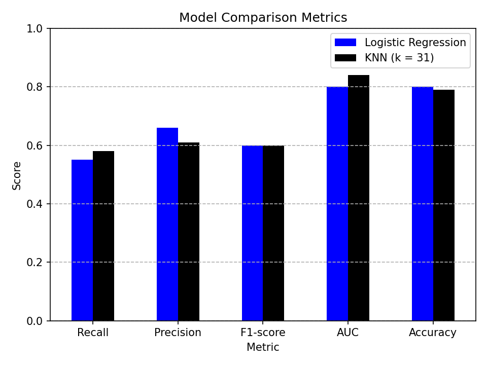

# Telco Customer Churn Prediction

This project focuses on predicting customer churn using supervised learning techniques.
The goal is to identify customers who are likely to leave a telecom service provider and provide insights aligned with business objectives.

## Dataset
- Telco Customer Churn Dataset (IBM Sample Dataset)
- Source: Kaggle

## Models Used
- Logistic Regression
- K-Nearest Neighbors (KNN)

## Evaluation Metrics
Given the class imbalance and business cost of missing churned customers, the following metrics were prioritized:
- Recall
- F1-score
- ROC-AUC

## Results
- Logistic Regression provided higher precision but lower recall for churned customers.
- KNN (k = 31) achieved a higher AUC and slightly better recall.
- Based on these results, KNN was selected as the final model.

## Model Comparison

The following chart compares the final performance metrics of Logistic Regression and KNN (k = 31):

## Files
- `telco-churn-logreg-knn.ipynb`: Full analysis and model development notebook

## Kaggle Notebook
- https://www.kaggle.com/code/efetasdelen/telco-churn-logreg-knn
